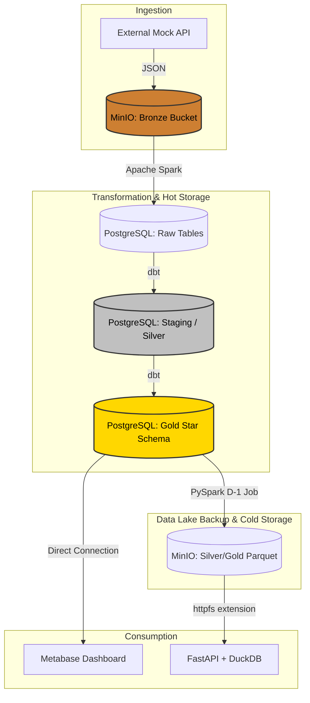

# 🚚 Smart Logistics Hub: Enterprise Data Platform


## 📌 Project Overview
The **Smart Logistics Hub** is an end-to-end data engineering platform designed to process, model, and analyze high-frequency IoT telemetry, warehouse dynamics, and fleet operations. 

Beyond traditional data ingestion, the primary purpose of this study is to establish a reliable, high-performance data backbone for advanced operations research and simulation. Built upon the Medallion Architecture (Bronze, Silver, Gold), the platform separates high-performance operational querying from long-term historical analysis to create a robust single source of truth.

The curated data models are specifically tailored to bridge the gap between raw data and prescriptive analytics. They serve as the foundational inputs for generating **Digital Twins** focused on warehouse optimization, and provide accurate, real-world parameters for **metaheuristic algorithms** aimed at solving complex vehicle routing and resource scheduling problems. Ultimately, this project demonstrates how modern, scalable data infrastructure is essential for validating mathematical optimization models in both academic research and industrial applications.

## 🏗️ Architecture & Data Flow



## 🛠️ Tech Stack
* **Orchestration:** Apache Airflow
* **Distributed Processing:** Apache Spark (PySpark)
* **Data Transformation & Modeling:** dbt (Data Build Tool)
* **Hot Storage (Low Latency):** PostgreSQL 15
* **Cold Storage / Data Lake:** MinIO (S3 Compatible)
* **In-Memory Analytics:** DuckDB
* **API Framework:** FastAPI
* **Data Visualization:** Metabase
* **DevOps / CI/CD:** Docker Compose, GitHub Actions
* **Infrastructure as Code (IaC):** Terraform

## 🚀 Key Features
* **Medallion Architecture:** Strict data quality layers ensuring reliable analytics.
* **Automated Data Quality:** CI/CD pipeline blocking schema regressions and ensuring business logic integrity via GitHub Actions and ephemeral PostgreSQL environments.
* **Hot/Cold Storage Segregation:** An automated daily Spark job unloads D-1 data from Postgres into highly compressed, partitioned Parquet files in MinIO.
* **In-Memory Analytics API:** A FastAPI service utilizing DuckDB to query Parquet files directly from the Data Lake with zero data movement.

## ⚙️ How to Run Locally

This project utilizes Docker, Terraform, and a `Makefile` to ensure a simple and fully standardized initialization in your local environment.

### 📋 Prerequisites
Before starting, ensure you have the following installed on your machine:
* **Docker** & **Docker Compose**
* **Terraform** (to provision the foundational infrastructure)
* **Make** (native on Linux and macOS; for Windows, using WSL2 is recommended)

### 🚀 Step-by-Step

1. **Clone the repository:**
```bash
   git clone [https://github.com/kaiki-pastore/smart-logistics-hub.git](https://github.com/kaiki-pastore/smart-logistics-hub.git)
   cd smart-logistics-hub
   ```

2. **Configure Environment Variables:**
   Create a copy of the example environment file and rename it to `.env`:
```bash
   cp .env.example .env
   ```
   *(Note: The default credentials inside `.env.example` are pre-configured to work seamlessly with the `docker-compose.yml` and Terraform setups).*

3. **Initial Setup:**
   Run the setup command to configure necessary folder permissions, local dependencies, or environment preparations:
```bash
   make setup
   ```

4. **Initialize the Containers:**
   The command below spins up all the containerized services (including the MinIO Data Lake) seamlessly:
```bash
   make up
   ```

5. **Provision Infrastructure (Terraform):**
   With MinIO now running, initialize Terraform to download the AWS provider, then apply the configuration to dynamically create the Medallion architecture buckets (`bronze`, `silver`, `gold`):
```bash
   cd infra/terraform
   terraform init
   terraform apply -auto-approve
   cd ../..
   ```

6. **Access the Service Interfaces:**
   Once the containers are up and healthy, the following tools will be available in your browser:
   * **Apache Airflow (Orchestration):** `http://localhost:8080`
   * **MinIO Console (S3 Data Lake):** `http://localhost:9001`
   * **Metabase (Visualization/BI):** `http://localhost:3000`
   * **Analytics API (FastAPI + DuckDB):** `http://localhost:8001/docs`

### 🧹 Stop and Clean the Environment

To stop all running services and completely remove local data volumes (wiping the state of the database and MinIO buckets), use the following command:
```bash
   make clean
   ```

---

## 📂 Repository Structure

```text
.
├── .github/workflows/     # CI/CD pipelines (e.g., dbt automated testing)
├── analytics-api/         # FastAPI + DuckDB application for in-memory analytics
├── api-mock/              # Mock external API generating IoT telemetry and orders
├── dags/                  # Apache Airflow DAGs for workflow orchestration
├── dbt_project/           # dbt models, tests, and configurations for Silver/Gold layers
├── infra/terraform/       # IaC for provisioning MinIO buckets
├── jobs/                  # PySpark scripts for data transformation and lake backups
├── .env.example           # Template for required environment variables
├── docker-compose.yml     # Container orchestration for the local data platform
├── Makefile               # Automation commands for environment setup and teardown
└── README.md              # Project documentation
```

---

## 🔮 Roadmap & Next Steps

With the core data infrastructure established, the next phases will focus on scaling the architecture for real-time processing and advanced analytics:

* **Real-Time Data Streaming:** Introduce Apache Kafka to replace the current mock ingestion, enabling true real-time streaming of IoT telemetry and fleet events.
* **Machine Learning Integration:** Leverage the Gold layer data to train predictive models, focusing on Estimated Time of Arrival (ETA) forecasting and predictive maintenance for the vehicles.
* **Route Optimization Algorithms:** Develop and integrate routing engines to solve the Vehicle Routing Problem (VRP) dynamically, applying advanced algorithms to optimize dispatch sequences and reduce delivery times.
